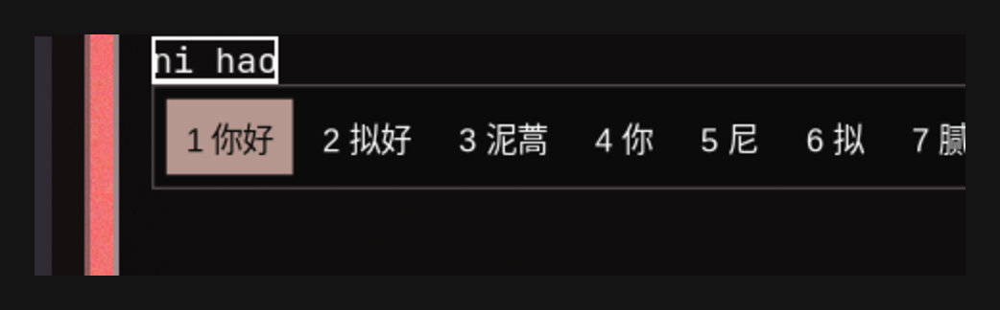

# omarchy-fcitx5-theme

> [English](README.md) | [简体中文](README.zh-CN.md)

Keep the fcitx5 input-method candidate box **automatically in sync with the Omarchy system theme**.

Run `omarchy theme set <theme>` and the candidate panel restyles instantly — no manual steps needed.



## How it works

This repo is an **Omarchy shell plugin (`service` kind)**, registered in the plugin market:

1. `omarchy theme set` writes the current theme's palette to
   `~/.local/state/omarchy/current/theme/colors.toml`
2. The plugin's service component watches that file with a `FileView` (Quickshell file watcher)
3. On change, it invokes a built-in generator that derives a matching fcitx5 candidate-box theme
   from the theme's `colors.toml` (`~/.local/share/fcitx5/themes/omarchy-<theme>/theme.conf`)
4. It writes `Theme=` into `~/.config/fcitx5/conf/classicui.conf` and restarts the fcitx5 app

The generator is **idempotent**: fcitx5 is only restarted when the theme actually changed, so it
can safely be invoked repeatedly by hooks, services, or timers.

## Installation

### Option 1: Plugin install (primary, recommended)

```bash
omarchy plugin add https://github.com/gmaxxxie/omarchy-fcitx5-theme.git --enable
```

The plugin ships with the full feature set: watch + generate + apply.

### Option 2: Full install (plugin + fallback hook)

```bash
git clone https://github.com/gmaxxxie/omarchy-fcitx5-theme && cd omarchy-fcitx5-theme
./install.sh
```

Additionally installs a `theme-set` hook as a fallback: when `omarchy theme set` runs in an
environment without the shell (e.g. SSH, scripts), the hook still syncs the candidate-box theme.

## Uninstall

```bash
omarchy plugin remove gmaxxxie.fcitx5-theme   # removes the plugin only
```

For a full cleanup (fallback hook, generated themes, config restore), run `./uninstall.sh`
from this repo:

- It removes **only the themes generated by this extension**, detected by the
  `Generated from Omarchy theme:` marker inside each `theme.conf`. Unrelated user themes that
  merely share the `omarchy-*` name pattern are left untouched.
- It restores the classicui theme that was active **before** this extension was installed
  (recorded at first run in `~/.local/state/omarchy-fcitx5-theme/state`), falling back to
  fcitx5's default theme when the previous value can't be recovered.
- It removes the `theme-set` hook and the state file, then restarts fcitx5 so the restored
  theme takes effect.

## Theme mapping

| Element | Mapping (colors.toml) |
|---------|------------------------|
| Panel background | `background` (dark themes) / `lighter_background` (light themes) |
| Candidate text | `foreground` |
| Selected candidate background | `accent`, deepened to luma ≈ 85 when the selected text is white |
| Selected candidate text | white, or `darker_background` when the accent is light (luma ≥ 150) |
| Panel border | `selection` (falls back to `muted`) |
| Menu separator | `bright_foreground` (falls back to border color) |

The panel and highlight keep Omarchy's hard square edges: `Color=` background with
`BorderWidth=1`, and the border colour comes from the theme's `selection`. The generator
no longer writes `[AccentColorField]`, which used to let a desktop accent portal
(GNOME/KDE) repaint the border, highlight and separator with the system accent colour and
lose the theme palette.

Both light and dark themes are supported: light themes (`mode = "light"`) get a light panel
with dark text, and the selected candidate is drawn as white text on a deepened accent so it
stays readable no matter how light the accent is.

## Manual usage

```bash
# Regenerate for the current theme
~/.config/omarchy/plugins/gmaxxxie.fcitx5-theme/fcitx5-classicui-theme.sh current

# Generate for a specific theme
~/.config/omarchy/plugins/gmaxxxie.fcitx5-theme/fcitx5-classicui-theme.sh tokyo-night
```

You can fine-tune the generated theme file by hand (font size, padding, etc.), then restart fcitx5:

```bash
omarchy restart xcompose
```

> Note: re-running the generator overwrites manual edits.

## FAQ

**Q: The candidate box didn't change?**
Restart fcitx5 with `omarchy restart xcompose`.
classicui reads the theme only at startup, and `fcitx5-remote -r` reloads config without swapping
themes. A plain `systemctl --user restart omarchy-fcitx5.service` is not enough when fcitx5 was
started outside the unit (e.g. D-Bus activated): the unit's instance exits because the stray
process still owns `org.fcitx.Fcitx5`, so the old theme keeps being served. `omarchy restart
xcompose` stops the unit, kills the stray instance, then starts the unit.

**Q: The plugin is enabled but switching themes has no effect?**
Check whether the service component is loaded: `omarchy plugin list` should show
`gmaxxxie.fcitx5-theme enabled third-party service`.
If it's missing, run `omarchy-shell shell rescanPlugins` and re-enable it.

**Q: My rime config in `custom/` isn't taking effect?**
`~/.local/share/fcitx5/rime/custom/` is only a template repository (librime does not scan
subdirectories); the effective `<schema>.custom.yaml` must live in the rime root directory
(same level as `wanxiang.schema.yaml`).

## File structure

```
omarchy-fcitx5-theme/
├── manifest.json                # Plugin manifest (service)
├── Service.qml                  # Service component: file watch + generator invocation
├── fcitx5-classicui-theme.sh    # Core generator (idempotent, standalone-runnable)
├── install.sh                   # Full install (plugin + fallback hook)
├── uninstall.sh                 # Full uninstall
├── preview.png                  # Preview
├── LICENSE                      # MIT
├── README.md                    # This file (English)
└── README.zh-CN.md              # 简体中文
```
